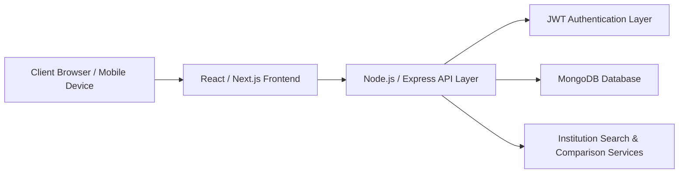
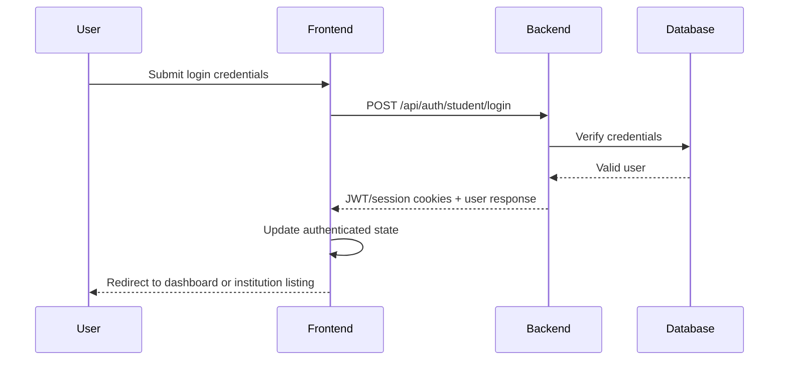

# OneLink – Institution Finder

> **A modern platform that helps students discover, compare, and explore the right institutions with confidence.**

[](https://nextjs.org/)
[](https://react.dev/)
[](https://nodejs.org/)
[](https://expressjs.com/)
[](https://www.mongodb.com/)
[](https://jwt.io/)
[](https://jestjs.io/)
[](https://docs.python.org/3/library/unittest.html)
[](https://vercel.com/)
[](https://render.com/)

---

## 📌 Project Overview

**OneLink – Institution Finder** is a responsive and scalable web platform designed to help students search, compare, and explore educational institutions such as:

- Schools
- Colleges
- Universities
- Coaching institutes

Students can discover institutions based on **location, courses, fees, ratings, and reviews**, making the decision-making process easier, faster, and more transparent.

Repository: [github.com/satvikksh/OneLink](https://github.com/satvikksh/OneLink)

---

## ✨ Features

- 🔍 Search institutions by name, location, course, and category
- 🏫 Explore schools, colleges, universities, and coaching institutes
- 📊 Compare institutions side by side
- 💰 Filter by fees, ratings, and available programs
- ⭐ View institution ratings and student reviews
- 🔐 Secure JWT-based authentication
- 👨‍🎓 Student login and personalized experience
- 🏢 Institution profile management
- 📱 Responsive layout for desktop, tablet, and mobile
- ⚡ Fast, maintainable, and scalable architecture
- 🧭 Protected routes with smooth post-login navigation

---

## 🛠️ Technologies Used

| Layer | Technology |
| --- | --- |
| Frontend | React, Next.js |
| Backend | Node.js, Express.js |
| Database | MongoDB |
| Authentication | JWT |
| Styling | CSS, Tailwind CSS |
| Testing | Jest, Python `unittest` |
| Deployment | Vercel, Render |
| Version Control | Git, GitHub |

---

## 🏗️ System Architecture Overview

OneLink is designed as a modular, responsive, and scalable system:



### Architecture Highlights

- **Frontend layer:** Handles routing, UI rendering, responsive layouts, and client interaction
- **Backend layer:** Manages APIs, authentication, validation, and business logic
- **Database layer:** Stores users, institutions, sessions, reviews, comparisons, and inquiries
- **Authentication layer:** Protects private routes using JWT-backed sessions
- **Scalability:** Supports future modules such as recommendations, analytics, and admin workflows

---

## 🚀 Installation Steps

### 1. Clone the repository

```bash
git clone https://github.com/satvikksh/OneLink.git
cd OneLink
```

### 2. Install dependencies

```bash
npm install
```

### 3. Start the development server

```bash
npm run dev
```

### 4. Open the application

```text
http://localhost:3000
```

---

## 🔐 Environment Variables Setup

Create a `.env.local` file in the project root.

### Example `.env.local`

```env
MONGODB_URI=mongodb://localhost:27017/onelink
JWT_SECRET=your_super_secret_jwt_key
COOKIE_SECRET=your_cookie_secret_key
NODE_ENV=development
NEXT_PUBLIC_APP_NAME=OneLink
```

> ⚠️ Never commit real secrets, passwords, or production credentials to GitHub.

---

## 📁 Folder Structure

```bash
OneLink/
├── app/
│   ├── api/                         # API routes
│   ├── components/                  # Reusable UI components
│   ├── institutes/                  # Institute authentication and dashboard pages
│   ├── students/                    # Student authentication and discovery pages
│   ├── src/
│   │   ├── lib/                     # Auth, database, session, and utility logic
│   │   ├── models/                  # MongoDB models
│   │   └── types/                   # Shared TypeScript types
│   ├── layout.tsx                   # Root layout
│   └── page.tsx                     # Landing page
├── public/                          # Static assets
├── middleware.ts                   # Protected-route middleware
├── next.config.ts                  # Next.js configuration
├── package.json
└── README.md
```

---

## 🔌 API Endpoints

| Method | Endpoint | Description |
| --- | --- | --- |
| `POST` | `/api/auth/student/register` | Register a student account |
| `POST` | `/api/auth/student/login` | Login a student |
| `POST` | `/api/auth/institute/register` | Register an institute account |
| `POST` | `/api/auth/institute/login` | Login an institute |
| `POST` | `/api/auth/logout` | Logout current user |
| `GET` | `/api/auth/me` | Fetch current authenticated user |
| `GET` | `/api/institutions` | Fetch institutions |
| `POST` | `/api/institutions` | Create or update institution data |
| `GET` | `/api/inquiries` | Fetch inquiry records |
| `POST` | `/api/inquiries` | Submit a student inquiry |

### Sample API Response

```json
{
  "message": "Student login successful.",
  "user": {
    "_id": "user_id",
    "name": "Aarav Sharma",
    "email": "aarav@example.com",
    "role": "student"
  },
  "redirect": "/students/discover"
}
```

---

## 🔑 Authentication Flow



### Authentication Process

1. User submits credentials
2. Backend validates the account
3. JWT/session cookies are generated
4. Auth state is updated on the client
5. Protected routes validate the session
6. Students are redirected to the discovery experience after login

---

## 🗄️ Database Design Overview

### Main Collections

| Collection | Purpose |
| --- | --- |
| `users` | Stores student and institute account details |
| `institutions` | Stores institution profiles, courses, fees, and facilities |
| `sessions` | Stores authenticated session records |
| `inquiries` | Stores student-to-institute inquiries |
| `reviews` | Stores student reviews and ratings |
| `comparisons` | Stores shortlisted or compared institutions |

### Example Institution Document

```json
{
  "name": "ABC University",
  "institutionType": "college",
  "city": "Delhi",
  "state": "Delhi",
  "courses": ["B.Tech", "MBA"],
  "annualFees": 120000,
  "rating": 4.5,
  "facilities": ["Library", "Hostel", "Labs"]
}
```

---

## 📐 UML / DFD Documentation

Recommended design documents for the project:

- Use Case Diagram
- Class Diagram
- Sequence Diagram
- Activity Diagram
- Data Flow Diagram (DFD)
- Entity Relationship Diagram (ERD)

> Add UML, DFD, and ERD assets inside a future `docs/` directory for complete technical documentation.

---

## 🖼️ Screenshots

> Add project screenshots here after deployment or UI finalization.

### Home Page

```md

```

### Institution Listing

```md

```

### Comparison View

```md

```

### Login Page

```md

```

---

## 🔮 Future Enhancements

- 🤖 AI-based institution recommendations
- 📍 Map integration for nearby institutions
- 🧠 Personalized smart filters
- 📊 Admin analytics dashboard
- 💬 Real-time student-institute chat
- 🔔 Push notifications
- 🌐 Multi-language support
- 📱 Dedicated mobile application
- 📄 Scholarship and admission update modules

---

## 🧪 Testing Information

The project can support both **unit testing** and **integration testing**.

### Unit Testing

- Frontend components with **Jest**
- Backend logic with **Python `unittest`** or JavaScript-based test utilities

### Integration Testing

- Authentication flow validation
- Route protection checks
- Database interaction tests
- API request/response verification

### Example Commands

```bash
npm run test
```

```bash
python -m unittest discover
```

---

## 🚢 Deployment Instructions

### Frontend Deployment on Vercel

1. Push the project to GitHub
2. Import the repository into Vercel
3. Add the required environment variables
4. Deploy

```bash
vercel
```

### Backend Deployment on Render

1. Create a new Web Service on Render
2. Connect the GitHub repository
3. Add environment variables
4. Use the following commands:

```bash
npm install
npm start
```

---

## 🤝 Contribution Guidelines

Contributions are welcome.

### How to Contribute

1. Fork the repository
2. Create a feature branch

```bash
git checkout -b feature/your-feature-name
```

3. Commit your changes

```bash
git commit -m "Add: your feature description"
```

4. Push your branch

```bash
git push origin feature/your-feature-name
```

5. Open a Pull Request

### Contribution Best Practices

- Follow clean coding standards
- Use meaningful commit messages
- Add or update tests when needed
- Keep documentation current
- Preserve responsive behavior across device sizes

---

## 📄 License

This project is licensed under the **MIT License**.

---

## 📬 Contact Information

**Project:** OneLink – Institution Finder  
**GitHub Repository:** [https://github.com/satvikksh/OneLink](https://github.com/satvikksh/OneLink)  
**Maintainer:** `satvikksh`  
**Email:** `satvikksh@gmail.com`  
**LinkedIn:** `https://www.linkedin.com/in/satvik-kushwaha-343452237/`

---

## ⭐ Support

If you find this project useful, consider giving it a ⭐ on GitHub.
